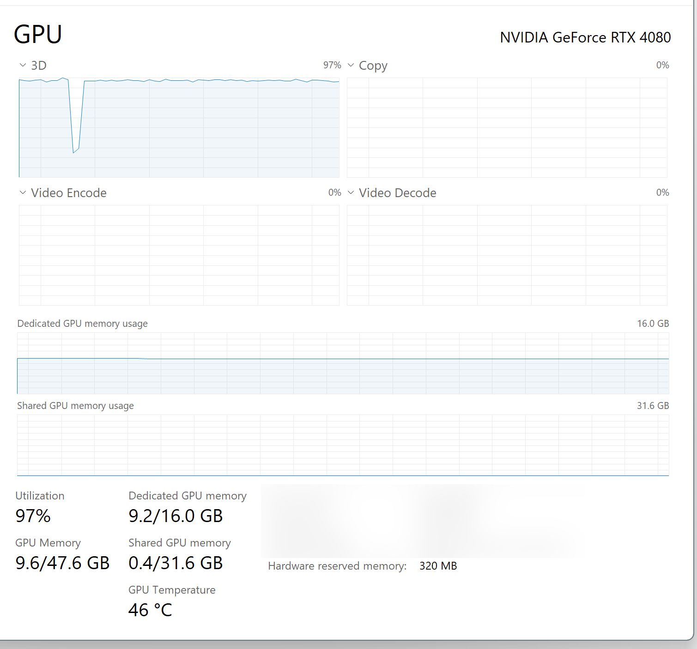

# video-summarization

Setup environment

```sh
python -m venv .venv
.\.venv\Scripts\Activate.ps1
pip install -r requirements.txt
```

You may also have to do this to get the GPU version of pytorch installed
```sh
pip uninstall torch torchvision torchaudio
pip cache purge
pip install torch torchvision torchaudio --index-url https://download.pytorch.org/whl/cu118
```

## Performance

The whisper audio -> text processing isn't as quick as I was expecting, even on a 4080.  It doens't seem to be CPU-bottlenecked decoding the MP3, as the GPU is showing fully-utilized (except when finishing a file and starting the next one), so maybe I just had a bad expectation of how fast `medium.en` should process.



Updated on 2023-10-24 to use [`faster-whisper`](https://github.com/guillaumekln/faster-whisper).  A file that took 2:07 to process with the default beam_size (which I think is 1) and the `medium.en` model with `whisper` took 1:03 with `beam_size=5` and the `large-v2` model with `faster-whisper`.  My understanding is increasing the beam size should hurt performance, and going from medium to large model should take twice as long, so that means `faster-whisper` is 4x faster (on my 4080) plus whatever the increased beam size would have cost with `whisper`.
